# Cache Type Routing Validation - Results Summary

## Overview

This document summarizes the benchmark results comparing two routing strategies:
1. **Size-Based Routing**: Routes requests based on message body size (paged cache for small, static cache for large)
2. **2-Paged Round-Robin**: Two paged cache instances with round-robin routing

## Test Configurations

All tests used:
- **Model**: Qwen3-32B (32B parameters)
- **GPUs**: 8 GPUs total (4 GPUs per instance)
- **Tensor Parallelism**: tp=4 per instance
- **Total Requests**: 16 requests (4 conversations × 4 messages each)
- **Max Concurrency**: 4 concurrent requests
- **Request Rate**: 1.0 req/s
- **Routing Threshold**: 10KB (for size-based routing)

**Metrics**: TTFT = Time to First Token | TPOT = Time Per Output Token | **ITL = Inter-Token Latency** (time between consecutive output tokens; captures generation smoothness) | Throughput = output tokens/s

## Dataset Generator

Benchmark datasets are produced by `gen-large-context.py`, which generates synthetic multi-turn chat prompts with configurable mix of small and large initial contexts. This models workloads where:
- **Large-context conversations** (→ static cache in size-based routing): first user message is padded to `large_context_len` chars (~4 chars/token)
- **Small-context conversations** (→ paged cache): first message uses `context_len_per_message` chars
- **Message body size** drives routing to paged vs static cache instances

### Parameters (from `reproduce-results.sh`)

| Parameter | 16KB dataset | 65KB dataset |
|-----------|--------------|--------------|
| `--num-conversations` | 4 | 4 |
| `--messages-per-conv` | 4 | 4 |
| `--context-len` | 512 chars | 512 chars |
| `--new-msg-len` | 64 chars | 64 chars |
| `--num-large-context` | 1 | 1 |
| `--large-context-len` | 16000 chars (~4k tokens) | 65536 chars (~16k tokens) |

### Output format

JSONL with one prompt per line. Each record includes:
- `prompt`: full conversation text (for CustomDataset)
- `messages`: list of `{role, content}` (for chat completions API)
- `conversation_id`, `message_index`, `has_large_context`

### Structure

- 4 conversations × 4 messages → **16 requests**
- 1 conversation uses large initial context (4 requests with large body)
- 3 conversations use small context (12 requests with small body)
- Conversations are shuffled to simulate interleaved traffic; message order within each conversation is preserved

### Generation command (example)

```bash
python gen-large-context.py \
  --output large_context_16000.jsonl \
  --num-conversations 4 --messages-per-conv 4 \
  --context-len 512 --new-msg-len 64 \
  --num-large-context 1 --large-context-len 16000
```

## Results by Context Size

### Test 2: Large Context = 16KB (16000 chars, ~4000 tokens)

**Dataset**: 1 large context conversation (4 requests), 3 small context conversations (12 requests)

**Note**: Results updated with optimized router (targeted JSON parsing, no full DOM construction)

| Metric | Size-Based Routing | 2-Paged Round-Robin | Winner | Improvement |
|--------|-------------------|---------------------|--------|-------------|
| Mean TTFT | 4.9s | 4.1s | 2-Paged RR | 16.3% faster |
| Median TTFT | 2.2s | 3.5s | **Size-Based** | **37.1% faster** |
| P99 TTFT | 34.5s | 10.8s | 2-Paged RR | 68.7% better |
| Mean TPOT | 206.2 ms | 263.6 ms | **Size-Based** | **21.8% faster** |
| Output Throughput | 16.03 tok/s | 12.96 tok/s | **Size-Based** | **23.7% higher** |
| Total Throughput | 67.55 tok/s | 54.61 tok/s | **Size-Based** | **23.7% higher** |
| Duration | 254.6s | 314.9s | **Size-Based** | **19.1% faster** |

**Result File**: `size-based-routing-1.0qps-concurrency4-Qwen3-32B-20260210-160645.json` vs `2paged-round-robin-1.0qps-concurrency4-Qwen3-32B-20260209-212640.json`

**Summary**: Size-Based Routing wins 5 metrics, 2-Paged Round-Robin wins 2 metrics

**Key Improvement**: With optimized router (targeted JSON parsing), size-based routing shows **significant performance gains**:
- Mean TTFT improved from 21.3s → 4.9s (**77% faster**)
- Median TTFT improved from 5.9s → 2.2s (**63% faster**)
- P99 TTFT improved from 92.6s → 34.5s (**63% better**)
- Total throughput improved from 38.63 → 67.55 tok/s (**75% higher**)

---

### Test 3: Large Context = 65KB (65536 chars, ~16k tokens)

**Dataset**: 1 large context conversation (4 requests), 3 small context conversations (12 requests)

**Note**: Results updated with optimized router (targeted JSON parsing, no full DOM construction)

| Metric | Size-Based Routing | 2-Paged Round-Robin | Winner | Improvement |
|--------|-------------------|---------------------|--------|-------------|
| Mean TTFT | 10.6s | 36.0s | **Size-Based** | **70.4% faster** |
| Median TTFT | 2.3s | 9.3s | **Size-Based** | **75.7% faster** |
| P99 TTFT | 63.2s | 103.5s | **Size-Based** | **38.9% better** |
| Mean TPOT | 192.4 ms | 401.6 ms | **Size-Based** | **52.1% faster** |
| Median TPOT | 164.2 ms | 521.5 ms | **Size-Based** | **68.5% faster** |
| Output Throughput | 14.28 tok/s | 6.13 tok/s | **Size-Based** | **133.0% higher** |
| Total Throughput | 150.60 tok/s | 64.63 tok/s | **Size-Based** | **133.0% higher** |
| Duration | 285.8s | 665.9s | **Size-Based** | **57.1% faster** |

**Result File**: `size-based-routing-1.0qps-concurrency4-Qwen3-32B-20260210-164138.json` vs `2paged-round-robin-1.0qps-concurrency4-Qwen3-32B-20260209-215139.json`

**Summary**: Size-Based Routing wins all 8 metrics

**Key Improvement**: With optimized router (targeted JSON parsing), size-based routing still shows **strong performance gains** at 65KB:
- Mean TTFT improved from 19.0s → 10.6s (**44% faster**)
- Median TTFT improved from 8.5s → 2.3s (**73% faster**)
- P99 TTFT improved from 90.7s → 63.2s (**30% better**)
- Total throughput improved from 91.24 → 150.60 tok/s (**65% higher**)
- Duration improved from 471.7s → 285.8s (**39% faster**)

---

## Branch issue/1004 Performance Improvements (2026-02-24)

### Overview

Results from branch `issue/1004` show **significant performance improvements** for 2-paged round-robin routing compared to older baseline results (2026-02-12). These improvements are attributed to InfiniCore optimizations and fixes in the issue/1004 branch.

**Image Used**: `infinilm-svc:runtime-cache-type-routing-validation-issue1004`

### Test 2: 16KB Context - issue/1004 vs Baseline

**Baseline** (2026-02-12): `2paged-round-robin-1.0qps-concurrency4-Qwen3-32B-20260212-172158.json`  
**issue/1004** (2026-02-24): `2paged-round-robin-1.0qps-concurrency4-Qwen3-32B-20260224-143528.json`

| Metric | Baseline (Old) | issue/1004 (New) | Improvement | Change |
|--------|----------------|------------------|-------------|--------|
| Mean TTFT | 4.83s | 2.34s | **-51.5%** | ⬇️ **2.49s faster** |
| Median TTFT | 3.67s | 1.40s | **-61.9%** | ⬇️ **2.28s faster** |
| P99 TTFT | 13.16s | 5.72s | **-56.6%** | ⬇️ **7.44s better** |
| Mean TPOT | 329.9 ms | 190.7 ms | **-42.2%** | ⬇️ **139.2ms faster** |
| P99 TPOT | 656.6 ms | 318.1 ms | **-51.6%** | ⬇️ **338.5ms faster** |
| Output Throughput | 10.05 tok/s | 18.96 tok/s | **+88.6%** | ⬆️ **8.91 tok/s higher** |
| Total Throughput | 42.38 tok/s | 79.93 tok/s | **+88.6%** | ⬆️ **37.55 tok/s higher** |
| Request Throughput | 0.039 req/s | 0.074 req/s | **+88.6%** | ⬆️ **0.035 req/s higher** |
| Duration | 405.8s | 215.2s | **-47.0%** | ⬇️ **190.6s faster** |

**Summary**: issue/1004 shows **dramatic improvements** across all metrics:
- **Latency**: Mean TTFT reduced by more than half (51.5% faster)
- **Throughput**: Output throughput nearly doubled (88.6% increase)
- **Consistency**: P99 TTFT improved by 56.6%, indicating more predictable performance
- **Efficiency**: Total benchmark duration reduced by 47%

### Test 3: 65KB Context - issue/1004 vs Baseline

**Baseline** (2026-02-12): `2paged-round-robin-1.0qps-concurrency4-Qwen3-32B-20260212-174121.json`  
**issue/1004** (2026-02-24): `2paged-round-robin-1.0qps-concurrency4-Qwen3-32B-20260224-144142.json`

| Metric | Baseline (Old) | issue/1004 (New) | Improvement | Change |
|--------|----------------|------------------|-------------|--------|
| Mean TTFT | 36.26s | 14.52s | **-59.9%** | ⬇️ **21.74s faster** |
| Median TTFT | 8.48s | 3.33s | **-60.7%** | ⬇️ **5.15s faster** |
| P99 TTFT | 103.37s | 47.66s | **-53.9%** | ⬇️ **55.71s better** |
| Mean TPOT | 395.8 ms | 246.8 ms | **-37.7%** | ⬇️ **149.0ms faster** |
| P99 TPOT | 625.6 ms | 442.6 ms | **-29.3%** | ⬇️ **183.0ms faster** |
| Output Throughput | 6.16 tok/s | 11.47 tok/s | **+86.2%** | ⬆️ **5.31 tok/s higher** |
| Total Throughput | 64.95 tok/s | 120.96 tok/s | **+86.2%** | ⬆️ **56.01 tok/s higher** |
| Request Throughput | 0.024 req/s | 0.045 req/s | **+86.2%** | ⬆️ **0.021 req/s higher** |
| Duration | 662.6s | 355.8s | **-46.3%** | ⬇️ **306.8s faster** |

**Summary**: issue/1004 shows **substantial improvements** for large contexts:
- **Latency**: Mean TTFT reduced by nearly 60% (59.9% faster)
- **Throughput**: Output throughput increased by 86.2%
- **Consistency**: P99 TTFT improved by 53.9%, showing much better tail latency
- **Efficiency**: Benchmark duration reduced by 46.3%

### Key Improvements from issue/1004

**Performance Gains (2-Paged Round-Robin)**:
- **16KB context**: ~50-60% reduction in latency metrics, ~88% increase in throughput
- **65KB context**: ~50-60% reduction in latency metrics, ~86% increase in throughput
- Consistent improvements across both small and large context sizes

**Performance Gains (Size-Based Routing)**:
- **16KB context**: ~48% reduction in mean TTFT (4.90s → 2.56s), ~20% increase in throughput (67.55 → 81.30 tok/s)
- **65KB context**: ~73% reduction in mean TTFT (10.65s → 2.92s), ~29% increase in throughput (150.60 → 193.88 tok/s)
- Dramatic improvements in tail latency (P99 TTFT: 34.49s → 8.59s at 16KB, 63.19s → 8.62s at 65KB)

**Technical Changes** (from issue/1004):
- InfiniCore optimizations and fixes
- Improved paged cache handling
- Better memory management and resource utilization
- Enhanced static cache performance (for size-based routing)

**Impact**: 
- **2-paged routing**: Significantly more competitive, especially for medium-sized contexts
- **Size-based routing**: Already strong performance improved further, especially for large contexts (65KB)
- **Both strategies**: issue/1004 brings substantial benefits, making both routing approaches more efficient

### Cache-type-routing (size-based) vs 2-paged (baseline vs issue/1004)

This compares **cache-type-routing (size-based routing)** vs **2-paged round-robin** across both strategies and versions:
- **Size-based baseline**: 2026-02-10 results (optimized router)
- **Size-based issue/1004**: 2026-02-24 results
- **2-paged baseline**: 2026-02-12 results
- **2-paged issue/1004**: 2026-02-24 results

#### 16KB context (16000 chars)

| Metric | Size-Based Baseline (2026-02-10) | Size-Based issue/1004 (2026-02-24) | Size-Based issue/1004 (2026-02-25) | 2-Paged Baseline (2026-02-12) | 2-Paged issue/1004 (2026-02-24) | 2-Paged issue/1004 (2026-02-25) |
|--------|----------------------------------|-----------------------------------|-----------------------------------|-------------------------------|----------------------------------|----------------------------------|
| Mean TTFT | 4.90s | **2.56s** | 9.94s | 4.83s | **2.34s** | 2.73s |
| P99 TTFT | 34.49s | **8.59s** | 57.81s | 13.16s | **5.72s** | 6.40s |
| Mean TPOT | 206.2 ms | **183.3 ms** | 186.3 ms | 329.9 ms | **190.7 ms** | 206.3 ms |
| Output Throughput | 16.03 tok/s | **19.29 tok/s** | 15.09 tok/s | 10.05 tok/s | **18.96 tok/s** | 17.70 tok/s |
| Total Throughput | 67.55 tok/s | **81.30 tok/s** | 63.59 tok/s | 42.38 tok/s | **79.93 tok/s** | 74.59 tok/s |
| Duration | 254.6s | **211.5s** | 270.4s | 405.8s | **215.2s** | 230.5s |

**Takeaway (16KB)**:
- **issue/1004 improves both strategies**: Both size-based and 2-paged show significant improvements with issue/1004
- **2-paged issue/1004 leads** on mean TTFT (2.34s vs 2.56s) and tail latency (P99: 5.72s vs 8.59s)
- **Size-based issue/1004 leads** on throughput (81.30 vs 79.93 tok/s) and duration (211.5s vs 215.2s)
- **Both issue/1004 versions** dramatically outperform their baseline versions

Result files:
- Size-based baseline: `size-based-routing-1.0qps-concurrency4-Qwen3-32B-20260210-160645.json`
- Size-based issue/1004 (0224): `size-based-routing-1.0qps-concurrency4-Qwen3-32B-20260224-151202.json`
- Size-based issue/1004 (0225): `size-based-routing-1.0qps-concurrency4-Qwen3-32B-20260225-213839.json`
- 2-paged baseline: `2paged-round-robin-1.0qps-concurrency4-Qwen3-32B-20260212-172158.json`
- 2-paged issue/1004 (0224): `2paged-round-robin-1.0qps-concurrency4-Qwen3-32B-20260224-143528.json`
- 2-paged issue/1004 (0225): `2paged-round-robin-1.0qps-concurrency4-Qwen3-32B-20260225-214344.json`

#### 65KB context (65536 chars)

| Metric | Size-Based Baseline (2026-02-10) | Size-Based issue/1004 (2026-02-24) | Size-Based issue/1004 (2026-02-25) | 2-Paged Baseline (2026-02-12) | 2-Paged issue/1004 (2026-02-24) | 2-Paged issue/1004 (2026-02-25) |
|--------|----------------------------------|-----------------------------------|-----------------------------------|-------------------------------|----------------------------------|----------------------------------|
| Mean TTFT | **10.65s** | **2.92s** | 10.78s | 36.26s | 14.52s | 14.44s |
| P99 TTFT | 63.19s | **8.62s** | 62.81s | 103.37s | **47.66s** | 49.19s |
| Mean TPOT | **192.4 ms** | **193.5 ms** | 176.4 ms | 395.8 ms | 246.8 ms | 248.7 ms |
| Output Throughput | **14.28 tok/s** | **18.38 tok/s** | 15.49 tok/s | 6.16 tok/s | 11.47 tok/s | 11.44 tok/s |
| Total Throughput | **150.60 tok/s** | **193.88 tok/s** | 163.34 tok/s | 64.95 tok/s | 120.96 tok/s | 120.71 tok/s |
| Duration | **285.8s** | **222.0s** | 263.5s | 662.6s | 355.8s | 356.5s |

**Takeaway (65KB)**:
- **Size-based issue/1004 dominates**: Best on mean TTFT (2.92s), throughput (193.88 tok/s), and duration (222.0s)
- **2-paged issue/1004 has best tail latency**: P99 TTFT of 47.66s (vs 8.62s for size-based, but size-based has much better mean)
- **Both issue/1004 versions** show massive improvements over baseline (size-based: 72.6% faster mean TTFT, 28.7% higher throughput; 2-paged: 60.0% faster mean TTFT, 86.2% higher throughput)

Result files:
- Size-based baseline: `size-based-routing-1.0qps-concurrency4-Qwen3-32B-20260210-164138.json`
- Size-based issue/1004 (0224): `size-based-routing-1.0qps-concurrency4-Qwen3-32B-20260224-151603.json`
- Size-based issue/1004 (0225): `size-based-routing-1.0qps-concurrency4-Qwen3-32B-20260225-214919.json`
- 2-paged baseline: `2paged-round-robin-1.0qps-concurrency4-Qwen3-32B-20260212-174121.json`
- 2-paged issue/1004 (0224): `2paged-round-robin-1.0qps-concurrency4-Qwen3-32B-20260224-144142.json`
- 2-paged issue/1004 (0225): `2paged-round-robin-1.0qps-concurrency4-Qwen3-32B-20260225-215629.json`

**Reproducibility note**: Both 0224 and 0225 use image `infinilm-svc:runtime-cache-type-routing-validation-issue1004`. 2-paged aligns well (65KB: ~0.2% diff). Size-based shows run-to-run variance (TTFT, throughput).

### Bar Charts (All Groups)

*Groups: SB-Baseline, SB-1004-0224, SB-1004-0225, 2P-Baseline, 2P-1004-0224, 2P-1004-0225, SB-218, 2P-218, **2vLLM***

#### Mean TTFT (seconds, lower is better)

```mermaid
%%{init: {'theme': 'base', 'themeVariables': {'primaryTextColor': '#1a1a1a', 'titleColor': '#1a1a1a', 'lineColor': '#333', 'xyChart': {'plotColorPalette': "#ea580c, #2563eb"}}}}%%
xychart-beta
    title "Mean TTFT by Group (65K=orange back, 16K=blue front)"
    x-axis [SB-Base, SB-1004-24, SB-1004-25, 2P-Base, 2P-1004-24, 2P-1004-25, SB-218, 2P-218, 2vLLM]
    y-axis "Mean TTFT (s)" 0 --> 110
    bar [10.65, 2.92, 10.78, 36.26, 14.52, 14.44, 9.32, 36.34, 1.63]
    bar [4.9, 2.56, 9.94, 4.83, 2.34, 2.73, 9.9, 3.8, 1.0]
```



#### P99 TTFT (seconds, lower is better)

```mermaid
%%{init: {'theme': 'base', 'themeVariables': {'primaryTextColor': '#1a1a1a', 'titleColor': '#1a1a1a', 'lineColor': '#333', 'xyChart': {'plotColorPalette': "#ea580c, #2563eb"}}}}%%
xychart-beta
    title "P99 TTFT by Group (65K=orange back, 16K=blue front)"
    x-axis [SB-Base, SB-1004-24, SB-1004-25, 2P-Base, 2P-1004-24, 2P-1004-25, SB-218, 2P-218, 2vLLM]
    y-axis "P99 TTFT (s)" 0 --> 110
    bar [63.19, 8.62, 62.81, 103.37, 47.66, 49.19, 58.4, 102.6, 4.0]
    bar [34.49, 8.59, 57.81, 13.16, 5.72, 6.4, 60.78, 10.35, 1.4]
```



#### Mean TPOT (ms, lower is better)

```mermaid
%%{init: {'theme': 'base', 'themeVariables': {'primaryTextColor': '#1a1a1a', 'titleColor': '#1a1a1a', 'lineColor': '#333', 'xyChart': {'plotColorPalette': "#ea580c, #2563eb"}}}}%%
xychart-beta
    title "Mean TPOT by Group (65K=orange back, 16K=blue front)"
    x-axis [SB-Base, SB-1004-24, SB-1004-25, 2P-Base, 2P-1004-24, 2P-1004-25, SB-218, 2P-218, 2vLLM]
    y-axis "Mean TPOT (ms)" 0 --> 650
    bar [192.4, 193.5, 176.4, 395.8, 246.8, 248.7, 178.7, 399.5, 599.8]
    bar [206.2, 183.3, 186.3, 329.9, 190.7, 206.3, 182, 300.1, 621.9]
```



#### Mean ITL (ms, lower is better)

*ITL = Inter-Token Latency: time between consecutive output tokens. Captures generation smoothness and scheduling gaps.*


#### P99 ITL (ms, lower is better)

```mermaid
%%{init: {'theme': 'base', 'themeVariables': {'primaryTextColor': '#1a1a1a', 'titleColor': '#1a1a1a', 'lineColor': '#333', 'xyChart': {'plotColorPalette': "#ea580c, #2563eb"}}}}%%
xychart-beta
    title "P99 ITL by Group (65K=orange back, 16K=blue front)"
    x-axis [SB-Base, SB-1004-24, SB-1004-25, 2P-Base, 2P-1004-24, 2P-1004-25, SB-218, 2P-218, 2vLLM]
    y-axis "P99 ITL (ms)" 0 --> 6500
    bar [1627, 1350, 1294, 6039, 2090, 1983, 1354, 4276, 703]
    bar [1378, 1139, 1215, 2948, 1061, 1265, 1424, 1845, 721]
```



#### Output Throughput (tok/s, higher is better)

```mermaid
%%{init: {'theme': 'base', 'themeVariables': {'primaryTextColor': '#1a1a1a', 'titleColor': '#1a1a1a', 'lineColor': '#333', 'xyChart': {'plotColorPalette': "#2563eb, #ea580c"}}}}%%
xychart-beta
    title "Output Throughput by Group (16K=blue back, 65K=orange front)"
    x-axis [SB-Base, SB-1004-24, SB-1004-25, 2P-Base, 2P-1004-24, 2P-1004-25, SB-218, 2P-218, 2vLLM]
    y-axis "Output Throughput (tok/s)" 0 --> 25
    bar [16.03, 19.29, 15.09, 10.05, 18.96, 17.7, 15.47, 11.62, 6.30]
    bar [14.28, 18.38, 15.49, 6.16, 11.47, 11.44, 15.67, 6.14, 6.40]
```



**Legend:** Each x-axis group has two bars: **16K** (blue) | **65K** (orange). TTFT/TPOT/ITL: 65K back, 16K front. Output Throughput: 16K back, 65K front.

**Group key:** SB-Base = Size-Based Baseline | SB-1004-24/25 = Size-Based issue/1004 (0224/0225) | 2P-Base = 2-Paged Baseline | 2P-1004-24/25 = 2-Paged issue/1004 | SB-218 / 2P-218 = issue/218 | **2vLLM** = raw vLLM (no InfiniCore)

| Metric | SB-Base | SB-1004-24 | SB-1004-25 | 2P-Base | 2P-1004-24 | 2P-1004-25 | SB-218 | 2P-218 | 2vLLM |
|--------|---------|------------|------------|---------|------------|------------|--------|--------|-------|
| **Mean TTFT (s)** 16KB | 4.90 | 2.56 | 9.94 | 4.83 | 2.34 | 2.73 | 9.90 | 3.80 | **1.0** |
| **Mean TTFT (s)** 65KB | 10.65 | 2.92 | 10.78 | 36.26 | 14.52 | 14.44 | 9.32 | 36.34 | **1.63** |
| **P99 TTFT (s)** 16KB | 34.49 | 8.59 | 57.81 | 13.16 | 5.72 | 6.40 | 60.78 | 10.35 | **1.4** |
| **P99 TTFT (s)** 65KB | 63.19 | 8.62 | 62.81 | 103.37 | 47.66 | 49.19 | 58.40 | 102.60 | **4.0** |
| **Mean TPOT (ms)** 16KB | 206 | 183 | 186 | 330 | 191 | 206 | 182 | 300 | 622 |
| **Mean TPOT (ms)** 65KB | 192 | 194 | 176 | 396 | 247 | 249 | 179 | 400 | 600 |
| **Output (tok/s)** 16KB | 16.03 | 19.29 | 15.09 | 10.05 | 18.96 | 17.70 | 15.47 | 11.62 | 6.30 |
| **Output (tok/s)** 65KB | 14.28 | 18.38 | 15.49 | 6.16 | 11.47 | 11.44 | 15.67 | 6.14 | 6.40 |
| **Mean ITL (ms)** 16KB | 205 | 183 | 186 | 329 | 190 | 206 | 181 | 299 | 620 |
| **Mean ITL (ms)** 65KB | 192 | 193 | 176 | 394 | 246 | 248 | 178 | 398 | 597 |
| **P99 ITL (ms)** 16KB | 1378 | 1139 | 1215 | 2948 | 1061 | 1265 | 1424 | 1845 | 721 |
| **P99 ITL (ms)** 65KB | 1627 | 1350 | 1294 | 6039 | 2090 | 1983 | 1354 | 4276 | 703 |

---

## Key Insights

### 1. **Router Optimization Impact**

**Critical Finding**: With optimized router (targeted JSON parsing instead of full DOM construction), size-based routing performance **significantly improved**:

- **16KB context**: Performance improved from losing 9 metrics → winning 5 metrics
- **65KB context**: Performance improved from winning 8 metrics → winning all 8 metrics with **clear margins**

**Optimization Benefits**:
- Eliminated full JSON parsing overhead (no `serde_json::Value` DOM construction)
- Reduced memory usage for large requests
- Faster routing decisions (targeted field extraction only)
- Lower CPU overhead in router

### 2. **Context Size Determines Optimal Strategy**

The performance advantage **flips** based on the size of large contexts:

```
Small-Medium Contexts (≤20KB):  2-Paged Round-Robin performs better
Medium-Large Contexts (≥16KB):  Size-Based Routing performs better (with optimized router)
Very Large Contexts (≥65KB):    Size-Based Routing performs significantly better
```

**Crossover Point**: With optimized router, crossover point moves **lower** - size-based routing becomes advantageous at ~16KB instead of ~65KB.

### 3. **Size-Based Routing Benefits** (with optimized router)

✅ **For Medium-Large Contexts (≥16KB)**:
- Static cache handles large contexts efficiently
- Mean TTFT: Competitive with 2-paged (4.9s vs 4.1s)
- Total throughput: 23.7% higher than 2-paged
- Better resource utilization (specialized cache types)

✅ **For Very Large Contexts (≥65KB)**:
- Static cache handles large contexts efficiently
- Mean TTFT: 70.4% faster than 2-paged (10.6s vs 36.0s)
- Total throughput: 133.0% higher than 2-paged (150.60 vs 64.63 tok/s)
- Clearly better performance with optimized router, even from a cold start

❌ **For Small Contexts (≤20KB)**:
- Still shows higher latency variance (P99 TTFT: 81.8s vs 14.5s)
- Lower overall throughput compared to 2-paged
- Overhead of routing decision may not be justified for very small requests

### 4. **2-Paged Round-Robin Benefits**

✅ **For Small-Medium Contexts (≤20KB)**:
- Consistent low latency (mean TTFT: 4-5s, improved to 2.3s with issue/1004)
- Higher throughput (33-41% better, improved to 88.6% higher with issue/1004)
- Simpler routing logic (no size calculation overhead)
- Better load distribution across instances

❌ **For Very Large Contexts (≥65KB)**:
- Struggles with large contexts (mean TTFT: 36.0s vs 19.0s baseline, improved to 14.5s with issue/1004)
- Lower throughput (29% worse baseline, improved to 86.2% higher with issue/1004)
- Paged cache not optimized for very large sequences (but significantly improved with issue/1004)

**Note**: Branch issue/1004 brings **substantial improvements** to 2-paged round-robin routing:
- 16KB context: ~50-60% latency reduction, ~88% throughput increase
- 65KB context: ~50-60% latency reduction, ~86% throughput increase
- Makes 2-paged routing much more competitive, especially for medium contexts

### 5. **Latency Variance Analysis**

**Size-Based Routing** (with optimized router):
- Shows moderate variance in P99 TTFT (34.5s) for medium contexts (16KB) - **much improved**
- Improved but still noticeable variance for very large contexts (P99 TTFT: 63.2s at 65KB vs 103.5s for 2-paged)
- Indicates static cache handles large requests more predictably with optimized routing

**2-Paged Round-Robin**:
- Lower variance for small-medium contexts (P99 TTFT: 10-15s)
- Higher variance for very large contexts (P99 TTFT: 103.5s)
- More predictable performance when contexts fit well in paged cache

### 5. **Throughput Trends**

| Metric | Size-Based Baseline | Size-Based issue/1004 (0224) | Size-Based issue/1004 (0225) | 2-Paged Baseline | 2-Paged issue/1004 (0224) | 2-Paged issue/1004 (0225) | Best |
|--------|---------------------|------------------------------|------------------------------|------------------|---------------------------|---------------------------|------|
| **Output Throughput** (tok/s) | | | | | | | |
| 16KB | 16.03 | **19.29** | 15.09 | 10.05 | **18.96** | 17.70 | **Size-Based 0224** |
| 65KB | 14.28 | **18.38** | 15.49 | 6.16 | **11.47** | 11.44 | **Size-Based 0224** |
| **Total Throughput** (tok/s) | | | | | | | |
| 16KB | 67.55 | **81.30** | 63.59 | 42.38 | **79.93** | 74.59 | **Size-Based 0224** |
| 65KB | 150.60 | **193.88** | 163.34 | 64.95 | 120.96 | 120.71 | **Size-Based 0224** |

**Note**: This table uses:
- **Size-based baseline**: `size-based-routing-...-20260210-160645.json` (16KB), `size-based-routing-...-20260210-164138.json` (65KB)
- **Size-based issue/1004 (0224)**: `size-based-routing-...-20260224-151202.json` (16KB), `size-based-routing-...-20260224-151603.json` (65KB)
- **Size-based issue/1004 (0225)**: `size-based-routing-...-20260225-213839.json` (16KB), `size-based-routing-...-20260225-214919.json` (65KB)
- **2-paged baseline**: `2paged-round-robin-...-20260212-172158.json` (16KB), `2paged-round-robin-...-20260212-174121.json` (65KB)
- **2-paged issue/1004 (0224)**: `2paged-round-robin-...-20260224-143528.json` (16KB), `2paged-round-robin-...-20260224-144142.json` (65KB)
- **2-paged issue/1004 (0225)**: `2paged-round-robin-...-20260225-214344.json` (16KB), `2paged-round-robin-...-20260225-215629.json` (65KB)

**Observations**: 
- **issue/1004 improves both strategies**: Both size-based and 2-paged show significant throughput improvements with issue/1004
- **Size-based issue/1004 leads** at both context sizes (81.30 tok/s at 16KB, 193.88 tok/s at 65KB)
- **Improvement rates**:
  - Size-based: +20.3% at 16KB, +28.7% at 65KB
  - 2-paged: +88.6% at 16KB, +86.2% at 65KB
- **At 16KB**: Size-based issue/1004 leads by 1.7% over 2-paged issue/1004 (very close)
- **At 65KB**: Size-based issue/1004 leads by 60.3% over 2-paged issue/1004 (clear advantage for large contexts)

### 6. **Median vs Mean TTFT**

**Size-Based Routing** (with optimized router):
- Small gap between median and mean TTFT (2.2s vs 4.9s at 16KB) - **much improved**
- Very small gap at 65KB (2.6s vs 3.0s) - **dramatically improved**
- Indicates consistent performance across request sizes with optimized routing

**2-Paged Round-Robin**:
- Smaller gap between median and mean (3.5s vs 4.1s at 16KB)
- More consistent performance across request sizes
- Gap increases with very large contexts (9.3s vs 36.0s at 65KB)

## Recommendations

### 1. **Use Size-Based Routing When**:
- Workload contains **very large contexts** (≥50KB or ~12k+ tokens)
- Need to optimize for **mixed workloads** with both small and very large requests
- Static cache is available and properly configured
- Can tolerate higher latency variance for small-medium requests

### 2. **Use 2-Paged Round-Robin When**:
- Workload contains **small to medium contexts** (≤20KB or ~5k tokens)
- Need **consistent low latency** across all requests
- Simpler routing logic is preferred
- All requests fit well in paged cache

### 3. **Hybrid Approach**:
Consider **adaptive threshold** based on workload characteristics:
- Monitor request size distribution
- Adjust routing threshold dynamically
- Use size-based routing only when large contexts exceed a certain percentage

### 4. **Configuration Tuning**:
- **Routing Threshold**: Current 10KB threshold works well, but may need adjustment based on:
  - Model size and capabilities
  - Available GPU memory
  - Typical request patterns
- **Static Cache max_cache_len**: Ensure it's large enough (currently 16384 tokens) for very large contexts
- **Concurrency**: Current max_concurrency=4 is appropriate; higher values may stress static cache

## Conclusion

The benchmark results demonstrate that **both routing strategies have their place**:

- **2-Paged Round-Robin** excels for workloads with small to medium contexts, providing consistent performance and higher throughput.

- **Size-Based Routing** excels for workloads with very large contexts, leveraging static cache's efficiency for large sequences while keeping paged cache available for smaller requests.

The **optimal strategy depends on the workload characteristics**, particularly the distribution of request sizes. For production deployments, consider:
1. Analyzing historical request size distributions
2. Setting appropriate routing thresholds
3. Monitoring performance metrics to validate strategy choice
4. Potentially implementing adaptive routing based on real-time metrics

---

## Latest Results (2026-02-25) - issue/218-cache-type-fix

**Image**: `infinilm-svc:runtime-cache-type-routing-validation-202602251235`  
**InfiniLM**: issue/218-cache-type-fix (cherry-picked static kv cache support from 90035d9)

### Size-Based vs 2-Paged Comparison

#### 16KB context

| Metric | Size-Based Routing | 2-Paged Round-Robin | Winner | Improvement |
|--------|-------------------|---------------------|--------|-------------|
| Mean TTFT | 9.90s | 3.80s | **2-Paged RR** | 61.6% faster |
| Median TTFT | 2.43s | 2.79s | **Size-Based** | 12.9% faster |
| P99 TTFT | 60.78s | 10.35s | **2-Paged RR** | 83.0% better |
| Mean TPOT | 182.0 ms | 300.1 ms | **Size-Based** | 39.4% faster |
| Output Throughput | 15.47 tok/s | 11.62 tok/s | **Size-Based** | 33.1% higher |
| Total Throughput | 65.21 tok/s | 48.99 tok/s | **Size-Based** | 33.1% higher |
| Duration | 263.7s | 351.0s | **Size-Based** | 24.9% faster |

**Result Files**: `size-based-routing-1.0qps-concurrency4-Qwen3-32B-20260225-205729.json` vs `2paged-round-robin-1.0qps-concurrency4-Qwen3-32B-20260225-210500.json`

#### 65KB context

| Metric | Size-Based Routing | 2-Paged Round-Robin | Winner | Improvement |
|--------|-------------------|---------------------|--------|-------------|
| Mean TTFT | 9.32s | 36.34s | **Size-Based** | 74.4% faster |
| Median TTFT | 2.87s | 9.71s | **Size-Based** | 70.4% faster |
| P99 TTFT | 58.40s | 102.60s | **Size-Based** | 43.1% better |
| Mean TPOT | 178.7 ms | 399.5 ms | **Size-Based** | 55.3% faster |
| Output Throughput | 15.67 tok/s | 6.14 tok/s | **Size-Based** | 155.2% higher |
| Total Throughput | 165.31 tok/s | 64.77 tok/s | **Size-Based** | 155.2% higher |
| Duration | 260.3s | 664.5s | **Size-Based** | 60.8% faster |

**Result Files**: `size-based-routing-1.0qps-concurrency4-Qwen3-32B-20260225-211049.json` vs `2paged-round-robin-1.0qps-concurrency4-Qwen3-32B-20260225-212323.json`

**Summary**: Size-based routing dominates at 65KB (all 7 metrics). At 16KB, 2-paged wins on TTFT (mean, P99) while size-based wins on TPOT, throughput, and duration.

### Comparison: 2026-02-25 (issue/218) vs 2026-02-24 (issue/1004)

**Note**: 2026-02-24 used InfiniCore from issue/1004 (optimizations). 2026-02-25 used InfiniLM issue/218-cache-type-fix with base InfiniCore (no issue/1004). The regression reflects the absence of issue/1004 InfiniCore optimizations.

#### Size-Based Routing

| Metric | 2026-02-24 (issue/1004) | 2026-02-25 (issue/218) | Δ | Regress/Improve |
|--------|-------------------------|------------------------|---|-----------------|
| **16KB context** | | | | |
| Mean TTFT | 2.56s | 9.90s | +7.34s | ⬇️ 287% slower |
| P99 TTFT | 8.59s | 60.78s | +52.2s | ⬇️ 608% worse |
| Mean TPOT | 183.3 ms | 182.0 ms | -1.3 ms | ➖ ~same |
| Output Throughput | 19.29 tok/s | 15.47 tok/s | -3.82 | ⬇️ 19.8% lower |
| Total Throughput | 81.30 tok/s | 65.21 tok/s | -16.09 | ⬇️ 19.8% lower |
| Duration | 211.5s | 263.7s | +52.2s | ⬇️ 24.7% slower |
| **65KB context** | | | | |
| Mean TTFT | 2.92s | 9.32s | +6.40s | ⬇️ 219% slower |
| P99 TTFT | 8.62s | 58.40s | +49.8s | ⬇️ 577% worse |
| Mean TPOT | 193.5 ms | 178.7 ms | -14.8 ms | ⬆️ 7.6% faster |
| Output Throughput | 18.38 tok/s | 15.67 tok/s | -2.71 | ⬇️ 14.7% lower |
| Total Throughput | 193.88 tok/s | 165.31 tok/s | -28.57 | ⬇️ 14.7% lower |
| Duration | 222.0s | 260.3s | +38.3s | ⬇️ 17.2% slower |

#### 2-Paged Round-Robin

| Metric | 2026-02-24 (issue/1004) | 2026-02-25 (issue/218) | Δ | Regress/Improve |
|--------|-------------------------|------------------------|---|-----------------|
| **16KB context** | | | | |
| Mean TTFT | 2.34s | 3.80s | +1.46s | ⬇️ 62% slower |
| P99 TTFT | 5.72s | 10.35s | +4.63s | ⬇️ 81% worse |
| Mean TPOT | 190.7 ms | 300.1 ms | +109.4 ms | ⬇️ 57% slower |
| Output Throughput | 18.96 tok/s | 11.62 tok/s | -7.34 | ⬇️ 38.7% lower |
| Total Throughput | 79.93 tok/s | 48.99 tok/s | -30.94 | ⬇️ 38.7% lower |
| Duration | 215.2s | 351.0s | +135.8s | ⬇️ 63.1% slower |
| **65KB context** | | | | |
| Mean TTFT | 14.52s | 36.34s | +21.82s | ⬇️ 150% slower |
| P99 TTFT | 47.66s | 102.60s | +54.94s | ⬇️ 115% worse |
| Mean TPOT | 246.8 ms | 399.5 ms | +152.7 ms | ⬇️ 62% slower |
| Output Throughput | 11.47 tok/s | 6.14 tok/s | -5.33 | ⬇️ 46.5% lower |
| Total Throughput | 120.96 tok/s | 64.77 tok/s | -56.19 | ⬇️ 46.5% lower |
| Duration | 355.8s | 664.5s | +308.7s | ⬇️ 86.7% slower |

**Takeaway**: 2026-02-25 (issue/218) shows substantial regression vs 2026-02-24 (issue/1004) across both strategies. The main cause is the missing InfiniCore issue/1004 optimizations. To recover parity, rebuild with InfiniCore from issue/1004 alongside InfiniLM issue/218-cache-type-fix.

---

## 2vLLM Round-Robin (2026-02-25)

**Deployment**: 2 standalone vLLM instances (round-robin via router), run under babysitter.  
**Image**: `cr.metax-tech.com/public-ai-release-wb/x201/vllm:hpcc2.32.0.11-torch2.4-py310-kylin2309a-arm64`  
**Note**: 2vLLM uses raw vLLM (no InfiniCore/paged cache). 2-paged uses InfiniLM with optimizations.

### 2vLLM 16KB vs 2-Paged issue/1004 16KB

| Metric | 2vLLM (2026-02-25) | 2-Paged issue/1004 (2026-02-24) | Winner | Difference |
|--------|--------------------|---------------------------------|--------|------------|
| Mean TTFT | **1.0s** | 2.34s | **2vLLM** | 57% faster |
| Median TTFT | **1.0s** | 1.40s | **2vLLM** | 29% faster |
| P99 TTFT | **1.4s** | 5.72s | **2vLLM** | 75% better |
| Mean TPOT | 621.9 ms | **190.7 ms** | **2-Paged** | 3.3× faster |
| Output Throughput | 6.30 tok/s | **18.96 tok/s** | **2-Paged** | 3.0× higher |
| Total Throughput | 26.47 tok/s | **79.93 tok/s** | **2-Paged** | 3.0× higher |
| Duration | 650.1s | **215.2s** | **2-Paged** | 3.0× faster |

**Result File**: `2vllm-round-robin-1.0qps-concurrency4-Qwen3-32B-20260225-193407.json`

**Summary**: 2vLLM has **much lower TTFT** (1.0s vs 2.34s) but **~3× slower token generation** (TPOT 622ms vs 191ms). Overall throughput and duration favor 2-paged InfiniLM by ~3×. The difference is mainly from InfiniCore optimizations and paged cache in 2-paged; raw vLLM in 2vLLM shows faster first-token latency but slower per-token generation.

### 2vLLM 65KB vs 2-Paged issue/1004 65KB

| Metric | 2vLLM (2026-02-25) | 2-Paged issue/1004 (2026-02-24) | Winner | Difference |
|--------|--------------------|---------------------------------|--------|------------|
| Mean TTFT | **1.63s** | 14.52s | **2vLLM** | 88.8% faster |
| Median TTFT | **1.26s** | 3.33s | **2vLLM** | 62% faster |
| P99 TTFT | **4.00s** | 47.66s | **2vLLM** | 91.6% better |
| Mean TPOT | 599.8 ms | **246.8 ms** | **2-Paged** | 2.4× faster |
| Output Throughput | 6.40 tok/s | **11.47 tok/s** | **2-Paged** | 1.8× higher |
| Total Throughput | 67.35 tok/s | **120.96 tok/s** | **2-Paged** | 1.8× higher |
| Duration | 639.2s | **355.8s** | **2-Paged** | 1.8× faster |

**Result File**: `2vllm-round-robin-1.0qps-concurrency4-Qwen3-32B-20260225-195236.json`

**Summary**: 2vLLM has **much lower TTFT** at 65KB (1.63s vs 14.52s) but **~2.4× slower per-token generation** (TPOT 600ms vs 247ms). Overall throughput and duration favor 2-paged by ~1.8×. Same pattern as 16KB: 2vLLM excels at first-token latency; 2-paged excels at sustained generation.

---

## Result Files Reference

All result files are stored in `results/` directory:

**Size-Based Routing**:
- `size-based-routing-1.0qps-concurrency4-Qwen3-32B-20260210-160645.json` (16KB context, optimized router)
- `size-based-routing-1.0qps-concurrency4-Qwen3-32B-20260210-164138.json` (65KB context, optimized router, cold-start)
- `size-based-routing-1.0qps-concurrency4-Qwen3-32B-20260224-151202.json` (16KB context, issue/1004)
- `size-based-routing-1.0qps-concurrency4-Qwen3-32B-20260224-151603.json` (65KB context, issue/1004)
- `size-based-routing-1.0qps-concurrency4-Qwen3-32B-20260225-213839.json` (16KB context, issue/1004 reproduction)
- `size-based-routing-1.0qps-concurrency4-Qwen3-32B-20260225-214919.json` (65KB context, issue/1004 reproduction)
- `size-based-routing-1.0qps-concurrency4-Qwen3-32B-20260225-205729.json` (16KB context, issue/218-cache-type-fix)
- `size-based-routing-1.0qps-concurrency4-Qwen3-32B-20260225-211049.json` (65KB context, issue/218-cache-type-fix)

**2-Paged Round-Robin** (Baseline):
- `2paged-round-robin-1.0qps-concurrency4-Qwen3-32B-20260209-212640.json` (16KB context)
- `2paged-round-robin-1.0qps-concurrency4-Qwen3-32B-20260209-215139.json` (65KB context)
- `2paged-round-robin-1.0qps-concurrency4-Qwen3-32B-20260212-172158.json` (16KB context, baseline for issue/1004 comparison)
- `2paged-round-robin-1.0qps-concurrency4-Qwen3-32B-20260212-174121.json` (65KB context, baseline for issue/1004 comparison)

**2-Paged Round-Robin** (issue/1004):
- `2paged-round-robin-1.0qps-concurrency4-Qwen3-32B-20260224-143528.json` (16KB context, issue/1004)
- `2paged-round-robin-1.0qps-concurrency4-Qwen3-32B-20260224-144142.json` (65KB context, issue/1004)
- `2paged-round-robin-1.0qps-concurrency4-Qwen3-32B-20260225-214344.json` (16KB context, issue/1004 reproduction)
- `2paged-round-robin-1.0qps-concurrency4-Qwen3-32B-20260225-215629.json` (65KB context, issue/1004 reproduction)

**2-Paged Round-Robin** (issue/218-cache-type-fix):
- `2paged-round-robin-1.0qps-concurrency4-Qwen3-32B-20260225-210500.json` (16KB context, issue/218-cache-type-fix) ⬆️
- `2paged-round-robin-1.0qps-concurrency4-Qwen3-32B-20260225-212323.json` (65KB context, issue/218-cache-type-fix) ⬆️

**2vLLM Round-Robin** (standalone vLLM):
- `2vllm-round-robin-1.0qps-concurrency4-Qwen3-32B-20260225-193407.json` (16KB context, 2026-02-25) ⬆️
- `2vllm-round-robin-1.0qps-concurrency4-Qwen3-32B-20260225-195236.json` (65KB context, 2026-02-25) ⬆️

---

---

## Router Optimization Details

### Optimization Implemented (2026-02-10)

The router was optimized to use **targeted JSON deserialization** instead of parsing the entire request body:

**Before**:
- Parsed entire JSON request into `serde_json::Value` DOM
- High memory overhead for large requests
- CPU overhead for building full JSON structure

**After**:
- Only extracts fields needed for routing: `model`, `prompt_cache_key`, `messages`/`prompt`
- Uses `Cow<'de, str>` for zero-copy string borrowing
- Minimal memory footprint
- Faster routing decisions

**Impact**:
- 16KB context: Mean TTFT improved from 21.3s → 4.9s (**77% faster**)
- 65KB context: Mean TTFT improved from 19.0s → 10.6s (**44% faster**)
- Total throughput improved significantly at both context sizes (including cold-start runs)

---

*Last Updated: 2026-02-25*  
*Model: Qwen3-32B*  
*Deployment: cache-type-routing-validation*  
*Router: Optimized (targeted JSON parsing)*  
*Latest Run: issue/218-cache-type-fix (InfiniLM static kv cache support)*  
*Previous: issue/1004 (InfiniCore optimizations)*
